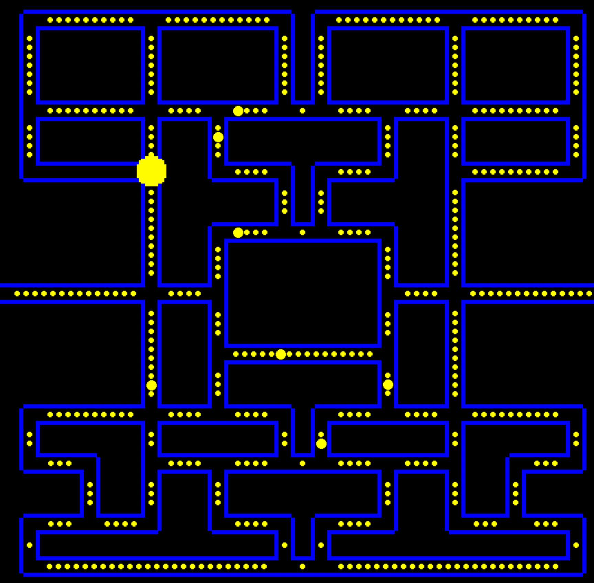
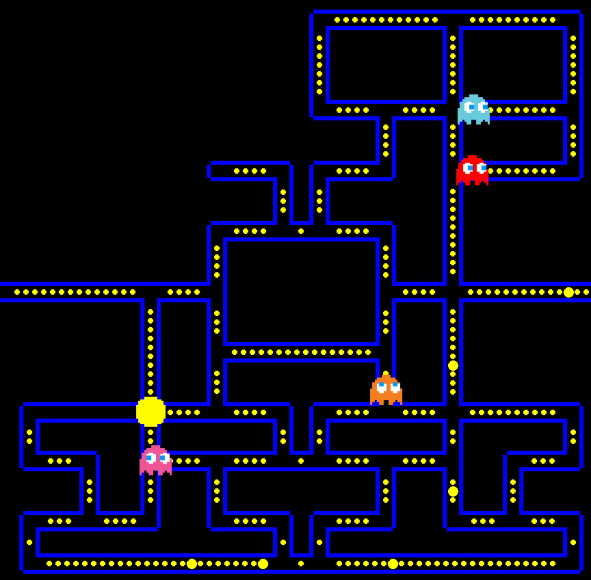
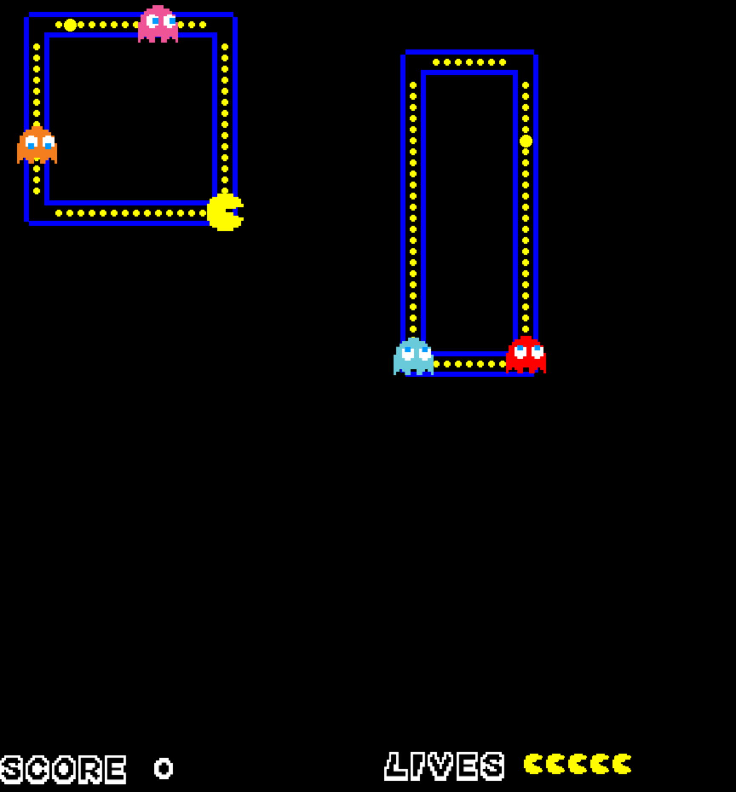
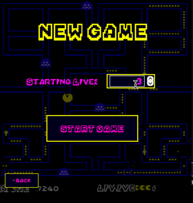

**SwingPacman**
---


---
- [How to play](#how-to-play)
- [Code Structure](#code-structure)
    - [1. Package Game:](#1-package-game)
    - [2. Package Map:](#2-package-map)
    - [3. Package Entities:](#3-package-entities)
    - [4. Package AudioEngine and Media](#4-package-audioengine-and-media)
    - [5. Package Painter and AnimationEngine](#5-package-painter-and-animationengine)
    - [6. Package Settings](#6-package-settings)
    - [7. Package GUI](#7-package-gui)
- [Download :dizzy:](#download-dizzy)
- [Guide to compiling :rocket:](#guide-to-compiling-rocket)
    - [1. Install Java 16](#1-install-java-16)
    - [2. Install Maven 3.8.1](#2-install-maven-381)
    - [3. Running the game](#3-running-the-game)
---
The classic **Pacman** game implemented in Java. 

The goal is simple: eat all food, save yourself from the ghosts that chase you and attack them when they are vulnerable!
\
\
\
This project spans from *6 May 2021* to *21 June 2021* (47 days).\
Developed as part of the final group project for _Programming Fundamentals 2 SP 2020-2021_, part of BSc INF at USI Lugano.

# How to play
To play the game, just run the ```main()``` method. Once you spawn on the map, use the arrow keys to navigate. The game ends when Pacman eats all food on the map or when he loses all of his lives. Pacman loses a single life whenever he collides with an invulnerable ghost.

Eating a single food grants you **20 points** and eating a ghost, when vulnerable, grants you **200 points**. You can keep track of your total score on the bottom left edge of the game screen and see remaining lives of Pacman on the bottom right edge of the game screen.

To pause the game, press `P`. To resume, press `U`.

# Code Structure


The program consists of **8 packages** and **37 classes**, each having a huge importance of the game implementation. It is structured in a way that is easily readable, modifiable and understandable. In almost every package, there is a main class that nearly all other sub-classes inherit from.\
The class hiearchy is organized at a high-level and every component that is a part of the game can be instantly classified into its corresponding position in the hierarchy.

### 1. Package Game:

This is the package that is responsible for running the game. It holds the main `Game` class, including the `GameState` and the `GameThread`.\
These classes handle the **start** and **end** of the game, perform an **intro** after every new round, the **death sequence** when Pacman dies and control the overall flow of the game.\
The `GameInputManager` takes the keyboard actions from the user and makes Pacman behave accordingly.

### 2. Package Map:
This is the package that holds all `Map` components. Our map is designed such that it is built from **nodes** connected by **edges**. The Pacman and Ghosts move along the edges and make a new turn whenever they are located on a `Node`.\
All nodes have a specific location on the map and every edge is built based on a relation between two nodes.\
**The map is not hardcoded**, therefore it can be easily modified based on player's preferences and it will not affect the playability of the game.

For example, this is the current map:




If needed, nodes and edges can be relocated to form a different map. In the example below, some of the edges are removed. The game still runs, the ghosts and the pacman will be able to move only along the edges which are present on the map:




### 3. Package Entities:
This package contains the classes of all visible Sprites on the map as well as classes that manage the interactions between them, such as:
* **Sprite**

A Sprite is an object to be displayed on the game screen. Any visible Sprite has its coordinates on the Map and a corresponding ENUM image.

* **Entity**

An Entity has an active presence on the Map and can collide with other entities. It extends the Sprite class, meaning it has its position on the Map and an Edge where it is currently located at.\
Every Entity has a ```colliding``` field which specifies whether it is able to collide with other entities in the moment or not.\
The  ```onCollision()``` method is overrriden by the subclasses and handles the effects when colliding with other entities.

* **MovingEntity**

This class extends the `Entity` class and represents a moving entity on the Map. All moving entites have the ability of navigating and moving through the Map.\
They have a field `speed` which determines the speed of the Entity and a field `direction` which determines the direction of moving. Every `MovingEntity` can call the method `step()` to step and move along their current edge in their specified direction.\
After every performed step of a `MovingEntity`, the `EntityManager` checks whether that entity has collided with another Entity present on the Map.

* **EntityManager**

This is an individual class which is responsible for managing the behaviour of entities, as well as interactions between active entities on the Map.\
The most important method is `checkCollisions(Entity e)` that is called by every `MovingEntity` after they perform a step along an Edge. The method then checks whether it collides with other entities by calling the method `areColliding(Entity a, Entity b)`.\
For example, if `Pacman` calls this method, then every Food that is on the same Edge as Pacman is passed as a parameter in the method, alongside Pacman itself. The method checks whether the passed entities collide by checking whether their images and positioning intersect on the Map.

* **Pacman**

The Pacman is a `MovingEntity` that is controlled by player's keyboard input.\
It can move in any direction as long as the wanted move is possible. While moving on an Edge it collides with the Food, eats it and gains score. The Food that is eaten is removed from the Map.\
It can also collide with an enemy `Ghost` and depending whether that Ghost is vulnerable or not, the Pacman can either eat it or be eaten by it and lose a life. Therefore, the Pacman has two fields `lives`, and `score`, which is initially 0.\
The `onCollision(Entity e)` method then updates Pacman's fields respectively depending whether it collided with a Ghost or a Food.\
If Pacman is eaten by a `Ghost`, the `GameThread` calls the method `performDeathSequence()` which resets the round, plays the death sequence sound and reshuffles the entities.\
The `Painter`(described later) updates the HUD displayed on the bottom of the game screen in real-time depending of the current Pacman score and lives.

* **Ghost**

The Ghost is a `MovingEntity` that randomly moves along the `Map`.\
Initially, the number of ghosts present on the Map is 4, but can be customized in the Settings.\
At the beginning of every round all ghost get assigned a random colored image so that all visible ghosts can differ from one another.\
The movement of every `Ghost` is determined by a priority queue which holds the upcoming directions and performs them once the Ghost reaches the next `Node`. A new random direction is added to the queue whenever the Ghost has to make a decision to turn. If the ghost cannot move at that direction that was randomly chosen, it unqueues it, and enqueues a different direction.\
A ghost holds a boolean field `vulnerable` which gets set to true when `Pacman` eats `LargeFood`. When this happens, the Ghosts become "scared" and can be eaten by the Pacman for a short duration of time.

* **Food**

A Food is an Entity that is spawned along every Edge on the Map. The food has a field `points` which are added to Pacman's score when he eats the food.\
When collided with Pacman, they are removed from the Game, and appear back again when a new game is started.\
There are 2 subclasses, `SmallFood` and `LargeFood`.\
The `SmallFood` is a regular food that just grants score to Pacman upon eating. The `LargeFood` makes instead the ghosts vulnerable for a short amount of time.

### 4. Package AudioEngine and Media

Audio and Sound Effects are necessary for this game to achieve the full experience. Depending on the current gamestate or actions performed, a corresponding sound is played from the Audio Engine. The following sounds can be recognized while playing:
* **Round Intro** - played on every start of round;
* **Round End, Death of Pacman** - played whenever a Pacman loses a life and is eaten from a Ghost.
* **Eating SmallFood** - played when Pacman eats a regular, Small Food.
* **Eating LargeFood** - played when Pacman eats the special food.
* **Ghosts are vulnerable** - played after Pacman eats a LargeFood, the Ghosts are vulnerable as long as the audio is playing.
* **Ghosts no longer vulnerable** - played when the vulnerability of all Ghosts has ended.

In the `Media` package, all ENUM classes are present where the sound, image and font files are listed. In the Media class, the required media files are imported into the game with static method `importMedia()`.

The **position** and **size** of all visible objects on the Map is *scaled* accordingly depending on player's screen size, thus ensuring that the gameplay experience does not differ on any screen size and DPI scaling.

### 5. Package Painter and AnimationEngine

This package contains two essential classes: `Painter` and `Scaler`. 

The `Painter` is responsible for making all components visible on the Map. Method `registerSprite(Sprite s)` registers a `Sprite` and displays it on the game screen.\
There is the subpackage `HUD` which holds the necessary JPanels and JLabels for the **Score**, **Lives** and **Current Round** HUDs.\
They are **updated real-time** depending on the current Pacman's score and lives, as well as the current round.

The `Scaler` is responsible for adjusting the size of the visible components to correlate to the player's screen size and resolution. This allows the game to be played on all screen sizes without any visual bugs. All interactions between Entities, such as collision are affected from the scaled size of the Object and not its original size.

The `AnimationEngine` handles all animations in the game, that is:
- Pacman opening and closing is mouth when moving
- The ghosts turning their eyes in the direction they're moving

The animations are implemented using EImage Maps that, given a starting image, return the next animation frame.

The package also has the `BlinkAnimator` class that allows easy **blinking of components**, such as sprites.

### 6. Package Settings

This package allows the player to customize the game and settings based on personal preferences. The following list of possible modifications is possible:
* Pacman Speed
* Pacman Starting Lives
* Ghost Count
* Ghost Speed
* Ghost Vulnerability Time
* Ghost Vulnerability Speed
* Food density
* Small Food Score
* Large Food Score
* Large Food Spawning Odd
* Map Line color
* Map Line thickness
* Map Background Color
* Map Path Width
* Label Size
* Label Color
* Control Keys

### 7. Package GUI


This package consists of the main menu interface.
Class `MainMenu` contains a `main()` method for starting the game with the Main Menu.

# Download :dizzy:
[**Latest release**](https://github.com/AlbertCerfeda/SwingPacman/releases/latest)


# Guide to compiling :rocket:

### 1. Install Java 16

[Java SE 16 Download page](https://www.oracle.com/java/technologies/javase-jdk16-downloads.html)

After installing Java 16, set the JAVA_HOME environment variable to point to the JDKs folder, like so:

```bash
export JAVA_HOME=/usr/lib/jvm/jdk-16.0.1/
```

### 2. Install Maven 3.8.1

Since we are using Java 16, you need to be using Apache Maven 3.8.1  
[Download page](https://maven.apache.org/download.cgi)

- Extract the tar.gz archive somewhere safe :wink:

- edit your .bashrc file and add the following lines
  
  ```bash
  export M2_HOME=<path-to-extracted-maven-archive>
  export M2=$M2_HOME/bin
  export PATH=$M2:$PATH
  ```

### 3. Running the game
You can run the game either with or without the Main Menu.
There are two `main()` methods you can run:
- `Game.Game.main`\
  Starts the game **without** the Main Menu

- `GUI.MainMenu.main`\
  Starts the game **with** the Main Menu

\
You should be good to go now :smiling_imp:
